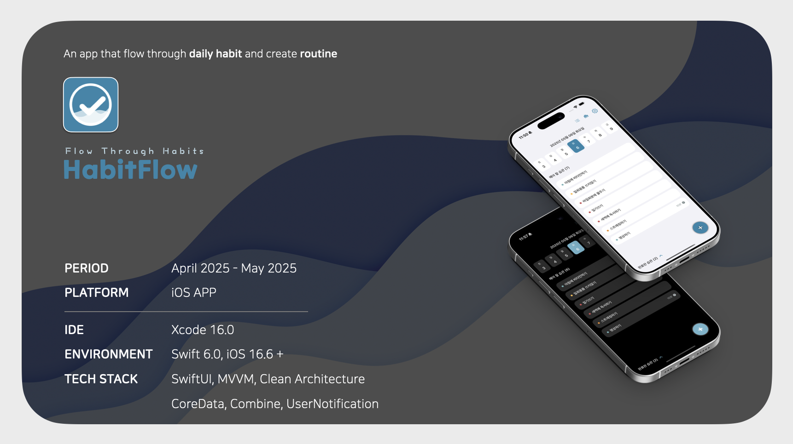

# HabitFlow

<p align="center">
  
</p>

## HabitFlow Structure
> Built with MVVM and Clean Architecture principles to ensure scalability, maintainability, and testability.

```swift
HabitFlow/
├── App
│   └── HabitFlowApp.swift
├── Core
│   └── Persistence
├── DI
├── Data
│   └── Repository
├── Domain
│   ├── Entity        
│   ├── UseCase       
│   ├── Enum          
│   └── Extensions
├── Presentation
│   ├── View
│   └── ViewModel    
└── Resources         
```

| **Layer** | **Path** | **Responsibility** |
| --- | --- | --- |
| **App** | `HabitFlow/App` | App entry point (@main), initializes DI container and environment |
| **Core** | `HabitFlow/Core` | Core infrastructure, utilities, and managers |
| **DI** | `HabitFlow/DI` | Dependency Injection containers, connects View ↔ ViewModel ↔ Domain |
| **Data** | `HabitFlow/Data/Repository` | Repository interfaces & implementations, persistence (CoreData) |
| **Domain** | `HabitFlow/Domain` | Core business logic (Entities, UseCases, Helpers) |
| **Presentation** | `HabitFlow/Presentation` | UI layer: SwiftUI Views and ViewModels |
| **Resources** | `HabitFlow/Resources` | Assets, localization, app icons, colors |

## **📌 Key Features**

- Weekly calendar to track today’s habits
- Routine statistics by category
- Weekly report summaries
- Habit reminder notifications
- Dark mode support

## **🛠️ Technical Highlights**

- Clean Architecture with MVVM
- Core Data for local persistence
- Asynchronous handling with Combine
- Enhanced modularity through Dependency Injection
